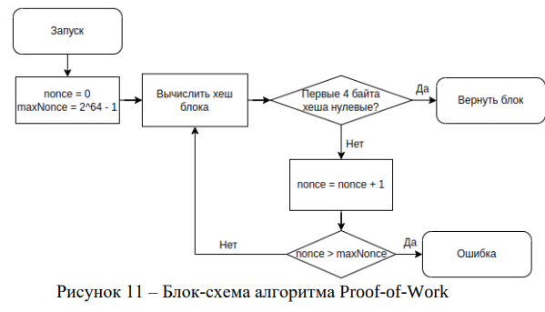
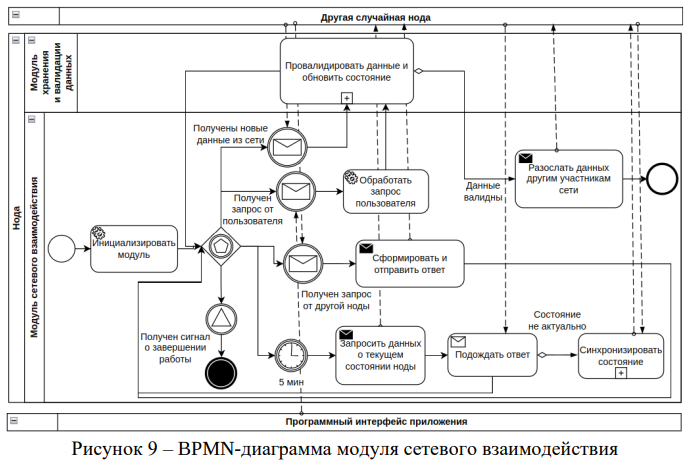
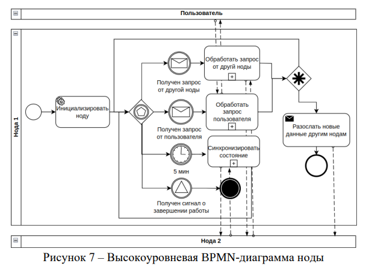

# process-and-system-design
Учебные проекты по проектированию БД, бизнес-процессов и информационных систем:

[[1]](./Taxi_ERD.pdf) ER-диаграмма и SQL для создания БД сервиса такси

[[2]](./ТехническаяПоддержкаBPMN.pdf) BPMN-диагрмма сервиса техническо поддержки

[[3]](./ТехническаяПоддержкаIDEF0.pdf) IDEF0-диаграмма сервиса технической поддержки

[[4]](./online-store/) Проектирование БД интернет магазина

[5] Блок-схема алгоритма консенсуса Proof-of-Work
(здесь и далее под нодой понимается [разработанная блокчейн нода](https://github.com/bountyHntr/kobla))

[6] Макет интерактивного консольного интерфейса ноды

[7] Модуль сетевого взаимодействия ноды (BPMN)

[8] Общая BPMN-диаграмма работы ноды

[9] Программные модули ноды

